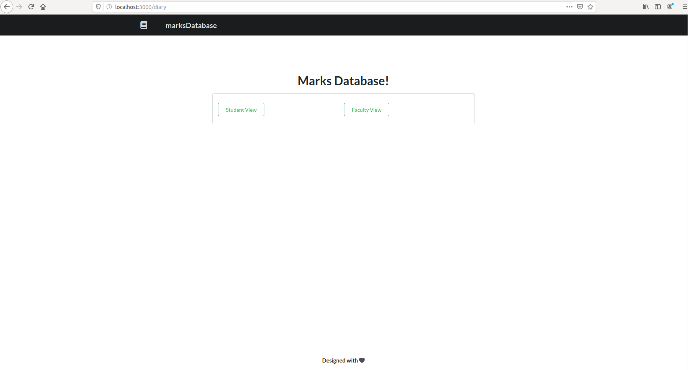
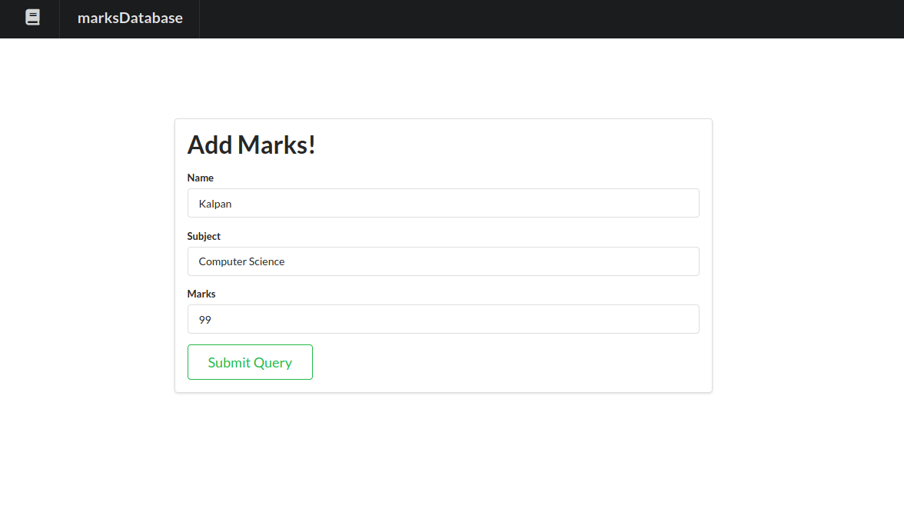
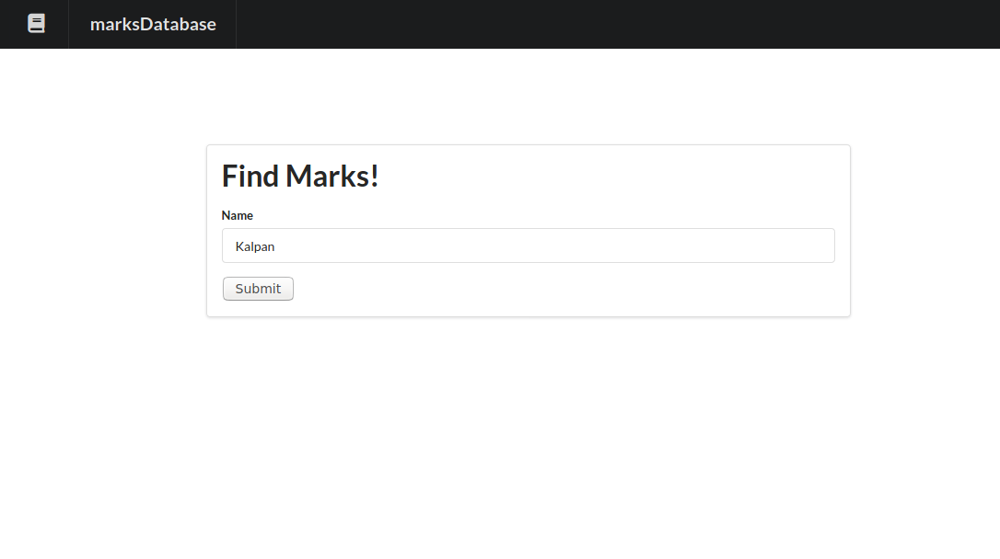
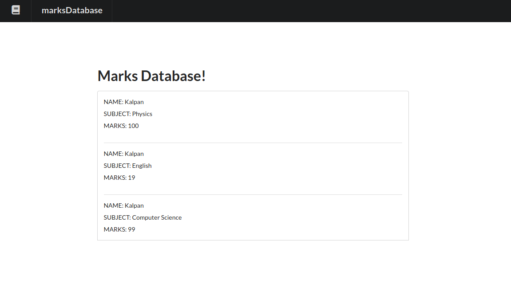
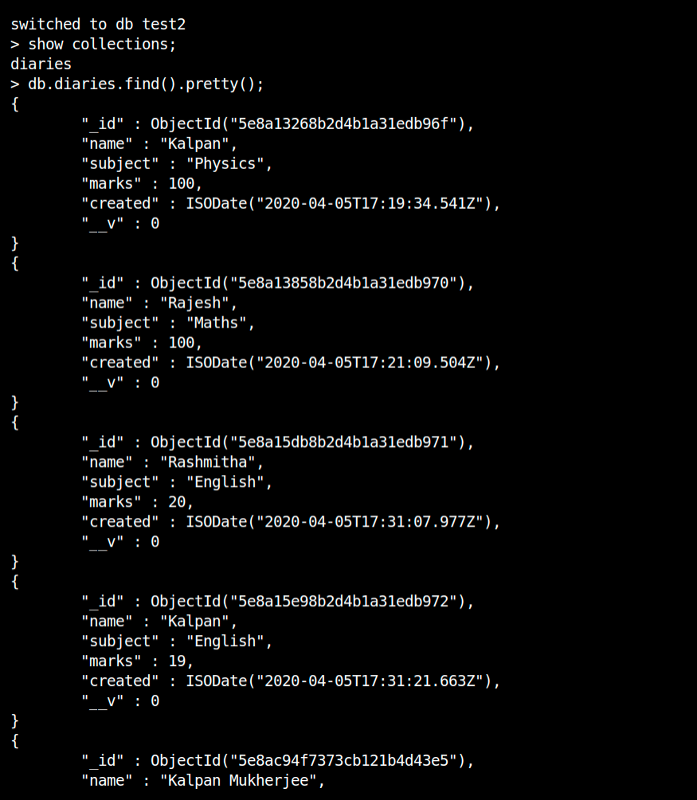

# Marks View
Students Results Database Management System

## How to run
1) install nodejs 
2) install npm 
3) install mongodb 
open up your terminal and navigate inside marks-view/marks 
run <i>npm install</i> 
run <i>node app.js</i> 
 
open localhost:3000

## Images
Student and Faculty Tab  

  
Entering Name, Subject and Marks in the Faculty Tab  

  
Entering Name to search for in the Student Tab  

  
Display Student Records Matching the given Name  

  
MongoDB Collection  

